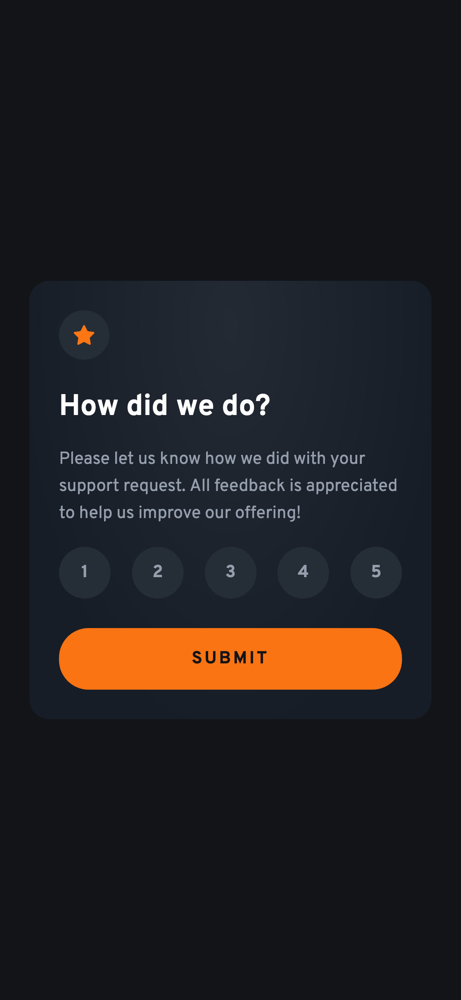
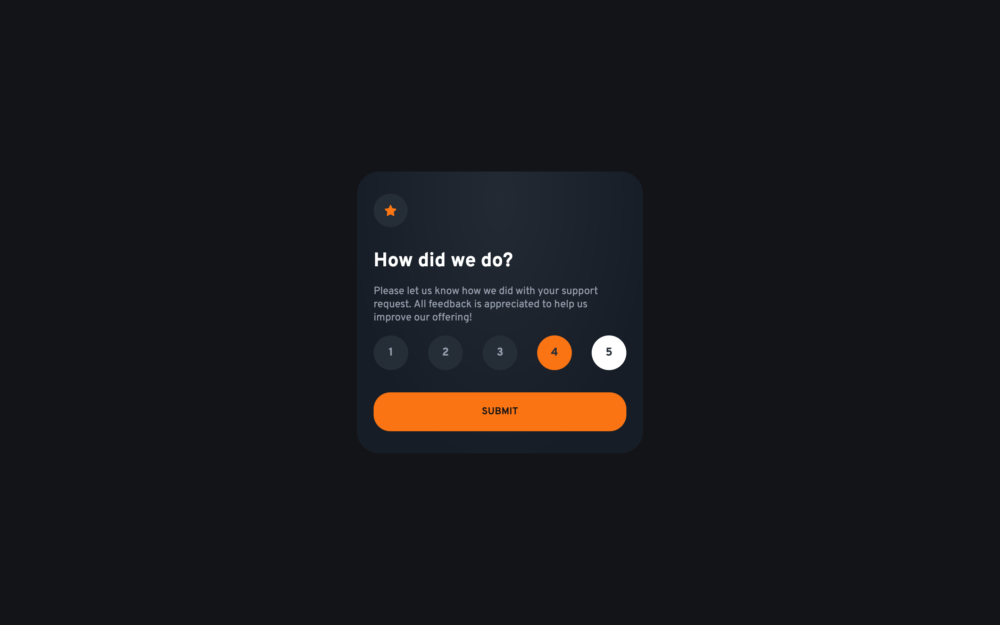
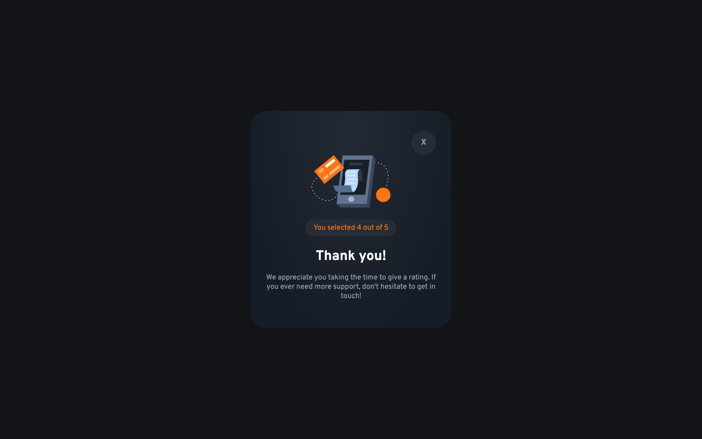

# Frontend Mentor - Interactive rating component solution

This is a solution to the [Interactive rating component challenge on Frontend Mentor](https://www.frontendmentor.io/challenges/interactive-rating-component-koxpeBUmI). Frontend Mentor challenges help you improve your coding skills by building realistic projects.

## Table of contents

- [Frontend Mentor - Interactive rating component solution](#frontend-mentor---interactive-rating-component-solution)
  - [Table of contents](#table-of-contents)
  - [Overview](#overview)
    - [The challenge](#the-challenge)
    - [Screenshot](#screenshot)
    - [Links](#links)
  - [My process](#my-process)
    - [Built with](#built-with)
    - [What I learned](#what-i-learned)
      - [1. Context API with useReducer for form state management](#1-context-api-with-usereducer-for-form-state-management)
      - [2. Controlled vs Uncontrolled component patterns](#2-controlled-vs-uncontrolled-component-patterns)
    - [Continued development](#continued-development)
      - [1. Advanced Form Patterns](#1-advanced-form-patterns)
      - [2. Context API Optimization](#2-context-api-optimization)
      - [3. Advanced TypeScript Patterns](#3-advanced-typescript-patterns)
      - [4. Accessibility in Custom Form Components](#4-accessibility-in-custom-form-components)
  - [Author](#author)

## Overview

### The challenge

Users should be able to:

- View the optimal layout for the app depending on their device's screen size
- See hover states for all interactive elements on the page
- Select and submit a number rating
- See the "Thank you" card state after submitting a rating

### Screenshot

**Mobile**

**Desktop with hover/focus states**

**Desktop thank you card**


### Links

- Live Site URL: [GitHub Pages](https://kmulqueen.github.io/interactive-rating-component/)

## My process

### Built with

- [TypeScript](https://www.typescriptlang.org/)
- [React](https://reactjs.org/) - JS library
- [Vite](https://vite.dev/) - Frontend build tool
- [Tailwind CSS](https://tailwindcss.com/) - For styles
- Mobile-first workflow
- Semantic HTML5 markup
- CSS custom properties
- Flexbox
- CSS Grid

### What I learned

#### 1. Context API with useReducer for form state management

I learned how to properly structure a form state management system using React Context and useReducer. Because this app is very small and doesn't contain very much logic for state management, the key insight was keeping actions simple and specific rather than trying to make them overly generic:

```tsx
// Simple, specific actions work better than generic ones
type FormAction =
  | { type: "SET_RATING"; payload: number }
  | { type: "SUBMIT_FORM" }
  | { type: "RESET_FORM" };

// Clean reducer with clear responsibilities
function formReducer(state: FormState, action: FormAction): FormState {
  switch (action.type) {
    case "SET_RATING":
      return { ...state, rating: action.payload };
    case "SUBMIT_FORM":
      return { ...state, isSubmitted: true };
    case "RESET_FORM":
      return { isSubmitted: false, rating: 0 };
    default:
      return state;
  }
}
```

#### 2. Controlled vs Uncontrolled component patterns

I learned the difference between controlled components (where React manages the state) and uncontrolled components (where the DOM manages the state), and when to use each:

```tsx
// Controlled component - React manages the state
<input
  type="radio"
  name="rating"
  value={label}
  checked={isChecked}  // React controls this
  onChange={handleChange}  // React handles changes
/>

// Uncontrolled component - DOM manages the state
<input
  type="radio"
  name="rating"
  value={label}
  // No checked prop, no onChange - DOM handles it
/>
```

### Continued development

#### 1. Advanced Form Patterns

I want to explore more complex form scenarios that would implement and benefit from FormData, such as:

- File upload handling
- Multi-step forms with mixed controlled/uncontrolled inputs
- Forms with dynamic field generation
- Integration with form validation libraries

#### 2. Context API Optimization

While I understand the basics of Context API, I want to dive deeper into:

- Performance optimization techniques (memo, useMemo, useCallback)
- Context splitting strategies for larger applications
- When to use Context vs other state management solutions

#### 3. Advanced TypeScript Patterns

I want to improve my TypeScript skills, particularly:

- More sophisticated generic types for reusable form components
- Better type inference for form validation
- Advanced utility types for form handling

#### 4. Accessibility in Custom Form Components

I want to focus more on:

- ARIA attributes for custom radio buttons and form controls
- Keyboard navigation patterns
- Screen reader compatibility testing
- Focus management in complex forms

## Author

- Website - [Kyle's GitHub](https://github.com/kmulqueen)
- Frontend Mentor - [@kmulqueen](https://www.frontendmentor.io/profile/kmulqueen)
